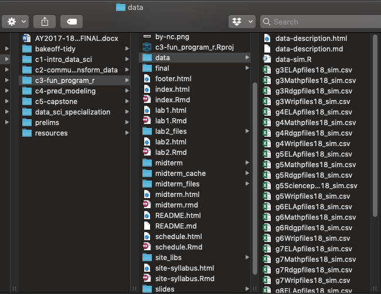

```{r setup, include = FALSE}
library(tidyverse)
theme_set(theme_minimal(20))
knitr::opts_chunk$set(fig.width = 13, 
                      message = FALSE, 
                      warning = FALSE)
```

# Agenda
* Discuss the midterm

	+ In-class portion (10 points; please don't stress)

	+ Take home (40 points)

* Review Lab 1

* `map_df` and batch-loading data

* Introduce list columns

---
# Learning objectives
* Understand when `map_df` can and should be applied

* Better understand file paths, and how `{fs}` can help

* Be able to batch load data of a specific type within a mixed-type directory

* Use filenames to pull data

---
class: inverse center middle
# Midterm
### Questions?
### Let's look at the take-home portion

---
class: inverse center middle
# Review Lab 1

---
# `map_df`
* If each iteration returns a data frame, you can use `map_df` to automatically bind all the data frames together.

---
# Example
* Create a function that simulates data

```{r simulate}
simulate <- function(n, mean = 0, sd = 1) {
	tibble(sample_id = seq_len(n),
	       sample = rnorm(n, mean, sd))
}
simulate(10)
```

---
# Simulation
* Assume we want to vary the sample size from 10 to 150 by increments of 5
* `mean` stays constant at 100, `sd` is constant at 10


--
### Try with `purrr::map`

---
```{r simulate-map}
library(tidyverse)
sims <- map(seq(10, 150, 5), simulate, 100, 10)
```

.pull-left[
```{r simulate-map1}
sims[1]
```
]

.pull-right[
```{r simulate-map2}
sims[2]
```
]

---
# Swap for `map_df`
### Try it - what happens?

--
```{r simulate-map_df}
sims_df <- map_df(seq(10, 150, 5), simulate, 100, 10)
sims_df
```

---
# Notice a problem here

```{r simulate-no-id}
sims_df[1:15, ]
```

---
# `.id` argument

```{r add-id-iteration}
sims_df2 <- map_df(seq(10, 150, 5), simulate, 100, 10, 
                   .id = "iteration")
sims_df2[1:14, ]
```

---
class: middle inverse

> `.id`: Either a string or NULL. If a string, the output will contain a
variable with that name, storing either the name (if .x is named) or the index (if .x is unnamed) of the input. If NULL, the default, no variable will be created.

\- [{purrr} documentation](https://purrr.tidyverse.org/reference/map.html)

---
# setNames

```{r setNames}
sample_size <- seq(10, 150, 5)
sample_size
sample_size <- setNames(sample_size, seq(10, 150, 5)) 
sample_size
names(sample_size)
```

---
# Try again

```{r add-id-sample_size}
sims_df3 <- map_df(sample_size, simulate, 100, 10, 
                   .id = "n")
sims_df3[1:14, ]
```

---
# Another quick example
### `broom::tidy`

* The {broom} package helps us extract model output in a tidy format

```{r tidy-model}
lm(tvhours ~ age, gss_cat) %>%
	broom::tidy()
```

---
# Fit separate models by year
### Again - probs not best statistically

```{r by_year}
 split(gss_cat, gss_cat$year) %>%
 	map_df(~lm(tvhours ~ age, .x) %>%
 	         broom::tidy()) 
 ```

---
# .id
In cases like the preceding, `.id` becomes invaluable

```{r by_year_id}
split(gss_cat, gss_cat$year) %>%
 	map_df(~lm(tvhours ~ age, .x) %>%
 	         broom::tidy(),
 	       .id = "year") 
```

---
class: inverse center middle
# Batch-loading data
### Please follow along

```{r out.width = "400px", echo = FALSE}

```

---
# {fs}

* note - there are base equivalents. `{fs}` is just a a bit better across
platforms and has better defaults. 

```{r fs1}
# install.packages("fs")
library(fs)
dir_ls("../data")
```

### Could we apply `map_df` here?

---
# Limit files
* We really only want the `.csv`

```{r fs2}
dir_ls("../data", glob = "*.csv")
```

---
# If we want to be extra careful
* Combine with `here::here`. This will be pretty bullet-proof from a
reproducibility perspective.

```{r here-fs}
dir_ls(here::here("data"), glob = "*.csv")
```

---
# Batch load
* Loop through the directories and `import` or `read_csv`

```{r batch_load1, message = FALSE}
files <- dir_ls(here::here("data"), glob = "*.csv")
batch <- map_df(files, read_csv)
batch
```

---
# Problem
* We've lost a lot of info - no way to identify which file is which

### Try to fix it!

---
# Add id

```{r add-id-batch}
batch2 <- map_df(files, read_csv, .id = "file")
batch2
```

---

```{r count-file}
batch2 %>%
	count(file)
```

* Still not terrifically useful. What can we do?

---
# Step 1

* Remove the `here::here` path from string

```{r remove-here}
batch2 <- batch2 %>%
	mutate(file = str_replace_all(file, here::here("data"), ""))

count(batch2, file)
```

---
# Pull out pieces you need

* Regular expressions are most powerful here

	+ We haven't talked about them much

* Try [RegExplain](https://www.garrickadenbuie.com/project/regexplain/)

---
# Pull grade

* Note - I'm not expecting you to just suddenly be able to do this. This is more
for illustration. There's also other ways you could extract the same info

```{r pull-grade}
batch2 %>%
	mutate(grade = str_replace_all(file, "/g(\\d?\\d).+", "\\1")) %>%
	select(file, grade)
```

---
# `parse_number`

* In this case `parse_number` also works - but note that it would not work to
extract the year

```{r grade-parse_number}
batch2 %>%
	mutate(grade = parse_number(file)) %>% #<<
	select(file, grade)
```

---
# Extract year

* In this case `parse_number` also works - but note that it would not work to
extract the year

```{r parse_year}
batch2 %>%
	mutate(grade = str_replace_all(file, "/g(\\d?\\d).+", "\\1"),
	       year = str_replace_all(file, ".+files(\\d\\d)_sim.+", "\\1")) %>% #<<
	select(file, grade, year)
```

---
# Extract Content Area

```{r content}
batch2 %>%
	mutate(grade = str_replace_all(file, "/g(\\d?\\d).+", "\\1"),
	       year = str_replace_all(file, ".+files(\\d\\d)_sim.+", "\\1"),
	       content = str_replace_all(file, "/g\\d?\\d(.+)pfiles.+", "\\1")) %>% #<<
	select(file, grade, year, content)
```

---
# Double checks: grade

```{r grade-double-check}
batch2 %>%
	mutate(grade = str_replace_all(file, 
	                               "/g(\\d?\\d).+", 
	                               "\\1"),
	       year = str_replace_all(file, 
	                              ".+files(\\d\\d)_sim.+", 
	                              "\\1"),
	       content = str_replace_all(file, 
	                                 "/g\\d?\\d(.+)pfiles.+", 
	                                 "\\1")) %>%
	select(file, grade, year, content) %>%
	count(grade)
```

---
# Double checks: year

```{r year-double-check}
batch2 %>%
	mutate(grade = str_replace_all(file, 
	                               "/g(\\d?\\d).+", 
	                               "\\1"),
	       year = str_replace_all(file, 
	                              ".+files(\\d\\d)_sim.+", 
	                              "\\1"),
	       content = str_replace_all(file, 
	                                 "/g\\d?\\d(.+)pfiles.+", 
	                                 "\\1")) %>%
	select(file, grade, year, content) %>%
	count(year)
```

---
# Double checks: content

```{r content-double-check}
batch2 %>%
	mutate(grade = str_replace_all(file, 
	                               "/g(\\d?\\d).+", 
	                               "\\1"),
	       year = str_replace_all(file, 
	                              ".+files(\\d\\d)_sim.+", 
	                              "\\1"),
	       content = str_replace_all(file, 
	                                 "/g\\d?\\d(.+)pfiles.+", 
	                                 "\\1")) %>%
	select(file, grade, year, content) %>%
	count(content)
```

---
# Finalize

```{r finalize-batch2}
d <- batch2 %>%
	mutate(grade = str_replace_all(file, "/g(\\d?\\d).+", "\\1"),
	       grade = as.integer(grade),
	       year = str_replace_all(file, ".+files(\\d\\d)_sim.+", "\\1"),
	       year = as.integer(grade),
	       content = str_replace_all(file, "/g\\d?\\d(.+)pfiles.+", "\\1")) %>%
	select(-file) %>%
	select(ssid, grade, year, content, testeventid, asmtprmrydsbltycd,
	       asmtscndrydsbltycd, Entry:WMLE)
```

---
# Final product
* In this case, we basically have a tidy data frame already! 

* We've reduced our problem from 31 files to a single file

```{r print-final}
d
```

---
# Quick look at distributions
```{r fig, echo = FALSE, fig.height = 8.5}
library(ggridges)
ggplot(d, aes(x = Theta, y = factor(grade))) +
	geom_density_ridges(fill = "cornflowerblue", 
	                    alpha = 0.8, 
	                    bandwidth = 0.3) +
	facet_wrap(~content)
```


---
# Calculate some summary stats

```{r summary-stats}
d %>%
	group_by(grade, content, asmtprmrydsbltycd) %>%
	summarize(mean = mean(Theta)) %>%
	spread(content, mean)
```

---
# Backing up a bit

* What if we wanted only math files?

```{r math}
dir_ls(here::here("data"), regexp = "Math")
```

---
# Only Grade 5
### You try

--
```{r g5}
dir_ls(here::here("data"), regexp = "g5")
```

---
# Base equivalents

```{r list.files1}
list.files(here::here("data"))
```

---
# Full path

```{r list.files2}
list.files(here::here("data"), full.names = TRUE)
```

---
# Only csvs

```{r list.files-csvs}
list.files(here::here("data"), 
           full.names = TRUE,
           pattern = "*.csv")

```

---
# Why not use base?
* We could, but `{fs}` plays a little nicer with `{purrr}`

--
```{r list.files-id-fail, error = TRUE}
files <- list.files(here::here("data"), pattern = "*.csv")
batch3 <- map_df(files, read_csv, .id = "file")
```

--
* Need to return full names

```{r files-not-full-names}
files
```

---
# Try again

```{r list.files-id-success, message = FALSE}
files <- list.files(here::here("data"), 
                    pattern = "*.csv", 
                    full.names = TRUE)
batch3 <- map_df(files, read_csv, .id = "file")
batch3
```

---
# indexes
* The prior example gave us indexes, rather than the file path. Why?


--
### No names
```{r vector-names}
names(files)
```

* We .bolder[need] the file path! An index isn't nearly as useful.

---
# Base method that works

```{r }
files <- list.files(here::here("data"), 
                    pattern = "*.csv", 
                    full.names = TRUE) 
files <- setNames(files, files)

batch4 <- map_df(files, read_csv, .id = "file")
batch4
```

---
# My recommendation
* If you're working interactively, no reason not to use `{fs}`

* If you are building functions that take generic paths, might be worth
considering skipping the dependency


--
### Note
I am .bolder[not] saying skip it, but rather that you should .bolder[consider]
whether it is really needed or not.

---
class: inverse center middle

# List columns

---
# Comparing models
Let's say we wanted to fit/compare a set of models for each content area

1. `lm(Theta ~ asmtprmrydsbltycd)`
1. `lm(Theta ~ asmtprmrydsbltycd + asmtscndrydsbltycd)`
1. `lm(Theta ~ asmtprmrydsbltycd + asmtscndrydsbltycd +
	asmtprmrydsbltycd:asmtscndrydsbltycd)`


---
# Split the data

The base method we've been using...

```{r split}
splt_content <- split(d, d$content)
str(splt_content)
```

---
# We could use this method

```{r fit-models-split}
m1 <- map(splt_content, ~lm(Theta ~ asmtprmrydsbltycd, 
          									data = .x))
m2 <- map(splt_content, ~lm(Theta ~ asmtprmrydsbltycd + 
                               			asmtscndrydsbltycd, 
														data = .x))
m3 <- map(splt_content, ~lm(Theta ~ asmtprmrydsbltycd*asmtscndrydsbltycd, 
          									data = .x))
```

* We could then go through and conduct tests to see which model was better, etc.


---
# Alternative
* Create a data frame with a list column

```{r list-column}
d %>%
	nest(-content)
```

---
# Add model list column

```{r list-column-model}
mods <- d %>%
	nest(-content) %>%
	mutate(m1 = map(data, ~lm(Theta ~ asmtprmrydsbltycd, 
          									data = .x)),
         m2 = map(data, ~lm(Theta ~ asmtprmrydsbltycd + asmtscndrydsbltycd, 
          									data = .x)),
         m3 = map(data, ~lm(Theta ~ asmtprmrydsbltycd*asmtscndrydsbltycd, 
          									data = .x)))
mods
```

---
# Part of the benefit
### It's a normal data frame!

```{r gather-models}
mods %>%
	gather(model, output, m1:m3)
```

---
# Extract all $R^2$

```{r extract-r2}
mods %>%
	gather(model, output, m1:m3) %>%
	mutate(r2 = map_dbl(output, ~summary(.x)$r.squared))
```

---
# Plot

```{r model-plot, fig.height = 4.5}
mods %>%
	gather(model, output, m1:m3) %>%
	mutate(r2 = map_dbl(output, ~summary(.x)$r.squared)) %>%
ggplot(aes(model, r2)) +
	geom_col(aes(fill = model)) +
	facet_wrap(~content) +
	guides(fill = "none") +
	scale_fill_brewer(palette = "Set2")
```

---
# Summary

* Batch processing is .bolder[really] powerful

* Much of the tools we've learned in the past can be applied once we get the
data in a more workable format

* List columns are also .bolder[really] nice for organization and using our data
frame toolkit


--
### Wednesday
* We'll talk more about list columns


--
### Any time left?
* Let's get started on the midterm